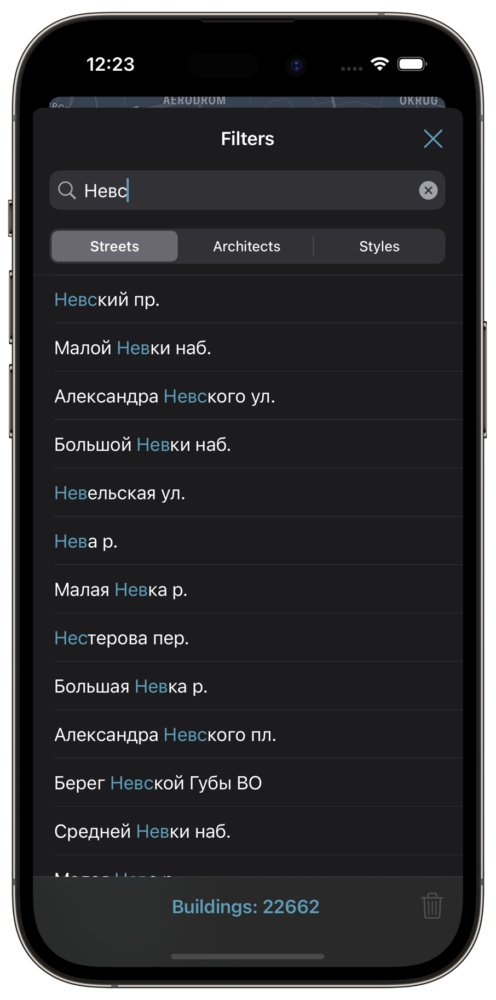
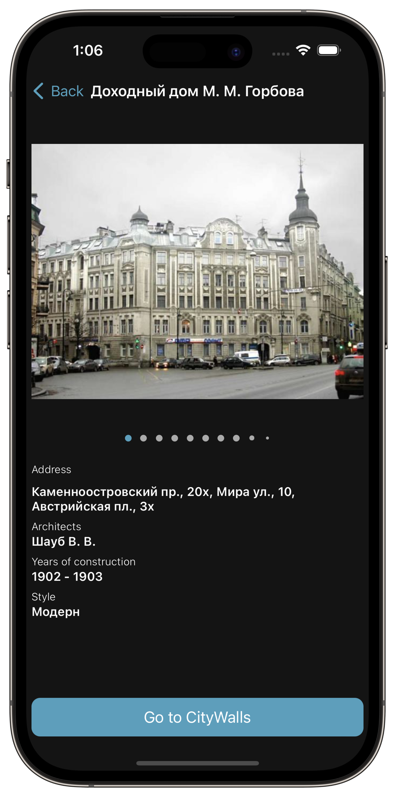
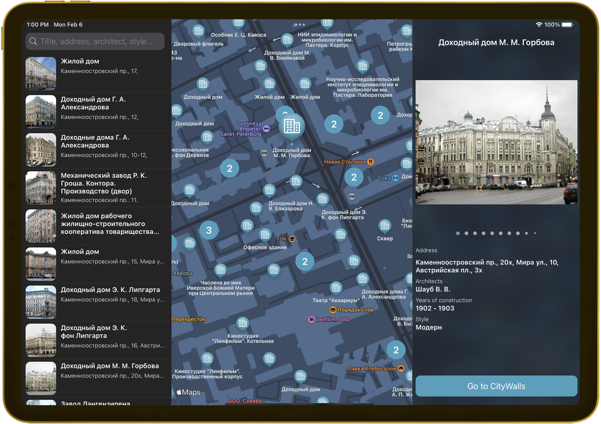

#  Spbscape

Discover the architectural wonders of Saint Petersburg with **Spbscape** app. Explore all the iconic buildings of the
city with just a few taps on your phone. You can search for buildings by style, architect, and address.
With [Algolia](https://www.algolia.com) powering the search function, finding your desired landmark is easier than ever. Download
the app now and embark on an architectural adventure in the beautiful city of Saint Petersburg.
Available for iPhone, iPad, and macOS, our app brings the beauty of Saint Petersburg's architecture to your fingertips.

## iOS

    
    
    
    

## iPadOS

## macOS

